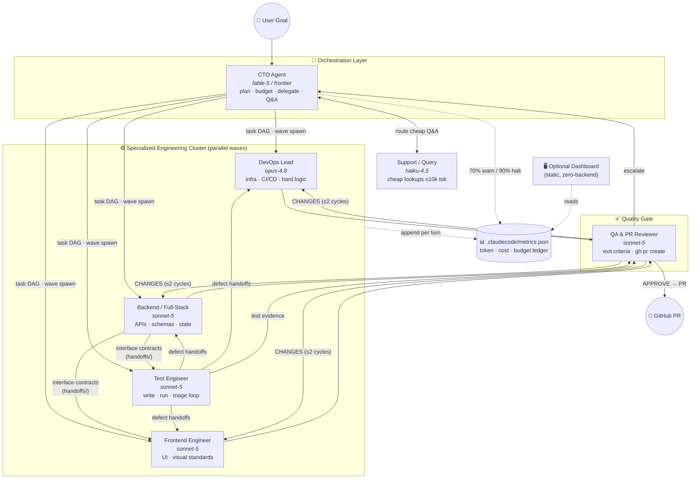

# ⚡ Claude Engineering Team

**A drop-in, self-hosted multi-agent software engineering org for Claude Code.**

One bash one-liner turns any repository into a workspace staffed by a seven-role AI engineering
team — a frontier-model CTO orchestrating parallel waves of specialized sub-agents (DevOps,
Frontend, Backend, Test, QA/PR, Support) with hard token budgets, contract-first parallelism,
and an optional cyberpunk monitoring dashboard. No backend, no lock-in, 100% local.

---

## System Architecture



**Communication rules:** agents never share raw transcripts — they exchange ≤40-line markdown
handoff files (`.claudecode/handoffs/`). The Backend agent publishes interface contracts *before*
implementing, so Frontend and Test run in the same parallel wave. QA gates everything; only QA
opens PRs.

**Enforcement model:** the CTO is the main Claude Code thread (subagents can't spawn subagents,
so orchestration lives at the top). The six specialists are native `.claude/agents/` subagents
whose restrictions are enforced by the harness, not by prose: QA has no Edit/Write tools (it can
verdict and `gh pr create`, never fix code), Support is Read/Grep/Glob-only on Haiku, and the
model ladder (haiku → sonnet → opus) is pinned in each charter's frontmatter.

## Repository Layout

```
claude-engineering-team/
├── .claude/
│   └── agents/             ← native subagent charters (one file per role,
│       ├── devops-lead.md     model + tool restrictions enforced by the harness)
│       ├── backend-engineer.md
│       ├── frontend-engineer.md
│       ├── test-engineer.md
│       ├── qa-reviewer.md     ← read-only + Bash: can verdict & open PRs, cannot edit code
│       └── support-query.md   ← Read/Grep/Glob only, haiku, 10k-token ceiling
├── .claudecode/
│   ├── instructions.md     ← CTO orchestration playbook (main thread = CTO)
│   └── metrics.json        ← append-only token/cost ledger (dashboard data source)
├── dashboard/
│   └── index.html          ← optional cyberpunk monitor (single file, zero deps)
├── scripts/
│   └── install.sh          ← one-liner bootstrap for any target repo
├── docs/
│   └── SETUP.md            ← onboarding + GitHub Pages security guide
└── .github/workflows/
    └── pages.yml           ← optional private Pages deploy for the dashboard
```

## Quick Start

Activate the team in **any** repository:

```bash
curl -fsSL https://raw.githubusercontent.com/RadhaKrishna0018/claude-engineering-team/master/scripts/install.sh | bash
```

Then just talk to Claude Code in that repo — the CTO takes over planning and delegation
automatically. The terminal is the whole product; the dashboard is optional:

```bash
# optional UI (any static server works)
cd dashboard && python -m http.server 4780
# → http://localhost:4780
```

Full onboarding, multi-tenant notes, and GitHub Pages security hardening: [docs/SETUP.md](docs/SETUP.md).

## Design Principles

1. **Universal portability** — the team is a markdown file, not a framework. Fork, clone, or
   `curl` it into any repo; each colleague's clone runs against *their own* local Claude
   environment and credentials. Nothing is shared, nothing phones home.
2. **Terminal-first** — every capability works headless in the CLI. The UI only *reads*
   `metrics.json`; it can never affect agent behavior.
3. **Token frugality as architecture** — model laddering (Haiku → Sonnet → Opus), prompt-cache
   friendly ordering, `ponytail`-style context folding, patch-based edits, and hard budget
   halt lines at 70%/90% of the cap.
4. **Zero-backend** — the dashboard is one static HTML file; deployable to private GitHub Pages
   or opened from disk.
